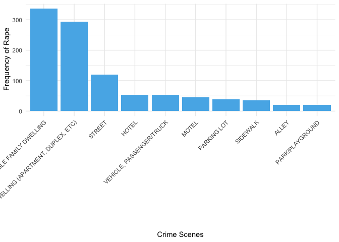
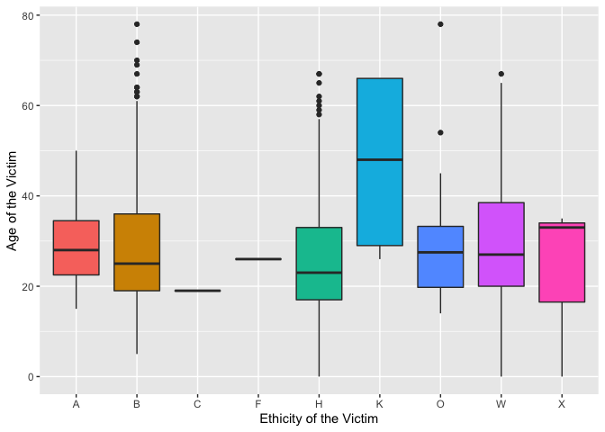
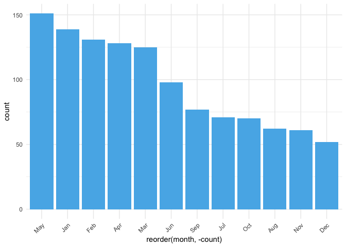
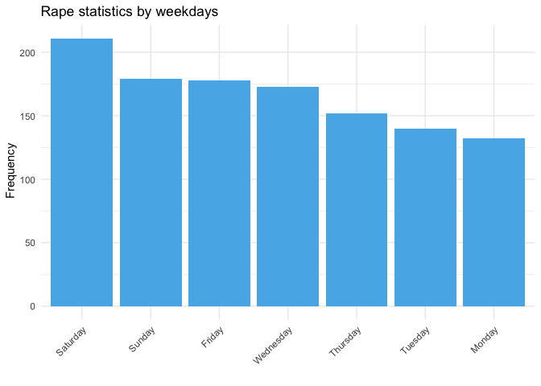
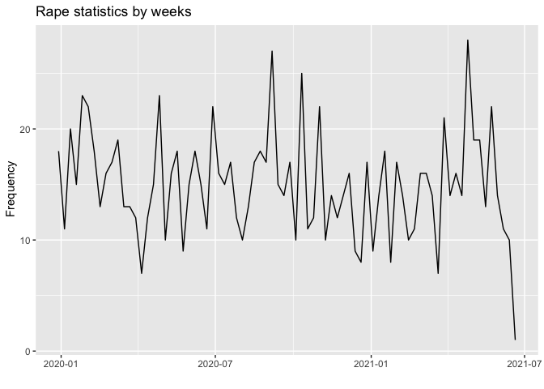

# Los Angles Crime data 

In this simulation, we will explore the Los Angeles crime statistics.
Since the crime types are so wide, we will only check-out RAPE FORCIBLE statistics. 

First we will load the data from the web. The data include updated statistics since 2020. It is a public file, so you can download and play with the data as well. 

#### Below are all the variables in the dataset, followed by its description:    
__DR_NO__ - Division of Records Number: Official file number made up of a 2 digit year, area ID, and 5 digits.
__DATE OCC__ - Date of crime occurrence(YYYY-MM-DD)  
__AREA__ - The LAPD has 21 Community Police Stations referred to as Geographic Areas within the department. These Geographic Areas are sequentially numbered from 1-21.  
__AREA NAME__ - The 21 Geographic Areas or Patrol Divisions are also given a name designation that references a landmark or the surrounding community that it is responsible for.  
__Rpt Dist No__ - Code that represents a sub-area within a Geographic Area.  
__Crm Cd__  - Indicates the crime committed.  
__Crm Cd Desc__ - Defines the Crime Code provided.
__Vict Age__ - Indicates the age of the victim.  
__Vict Sex__ - F: Female M: Male X: Unknown  
__Vict Descent__ - Descent Code: A - Other Asian B - Black C - Chinese D - Cambodian F - Filipino G - Guamanian H - Hispanic/Latin/Mexican I - American Indian/Alaskan Native J - Japanese K - Korean L - Laotian O - Other P - Pacific Islander S - Samoan U - Hawaiian V - Vietnamese W - White X - Unknown Z - Asian Indian
__Premis Cd__ - The type of structure, vehicle, or location where the crime took place. 
__Premis Desc__ - Defines the Premise Code provided.  
__Weapon Used Cd__ - The type of weapon used in the crime.  
__Weapon Desc__ - Defines the Weapon Used Code provided.  
__LOCATION __ - Street address of crime incident rounded to the nearest hundred block to maintain anonymity.  
__LAT__ - Latitude Coordinate.  
__LON__ - Longitude Coordinate.  


```r
# data
data <- read.csv("https://data.lacity.org/api/views/2nrs-mtv8/rows.csv?accessType=DOWNLOAD")

# required packages
library(tidyverse)
```

```
## ── Attaching packages ─────────────────────────────────────── tidyverse 1.3.1 ──
```

```
## ✓ ggplot2 3.3.3     ✓ purrr   0.3.4
## ✓ tibble  3.1.2     ✓ dplyr   1.0.6
## ✓ tidyr   1.1.3     ✓ stringr 1.4.0
## ✓ readr   1.4.0     ✓ forcats 0.5.1
```

```
## ── Conflicts ────────────────────────────────────────── tidyverse_conflicts() ──
## x dplyr::filter() masks stats::filter()
## x dplyr::lag()    masks stats::lag()
```

```r
library(lubridate)
```

```
## 
## Attaching package: 'lubridate'
```

```
## The following objects are masked from 'package:base':
## 
##     date, intersect, setdiff, union
```

```r
library(scales)
```

```
## 
## Attaching package: 'scales'
```

```
## The following object is masked from 'package:purrr':
## 
##     discard
```

```
## The following object is masked from 'package:readr':
## 
##     col_factor
```

```r
library(ggh4x) # for ggsubset function 
```


```r
# dimension
dim(data)
```

```
## [1] 284780     28
```

```r
# first six rows
head(data)
```

```
##       DR_NO              Date.Rptd               DATE.OCC TIME.OCC AREA
## 1  10304468 01/08/2020 12:00:00 AM 01/08/2020 12:00:00 AM     2230    3
## 2 190101086 01/02/2020 12:00:00 AM 01/01/2020 12:00:00 AM      330    1
## 3 201220752 09/16/2020 12:00:00 AM 09/16/2020 12:00:00 AM     1230   12
## 4 191501505 01/01/2020 12:00:00 AM 01/01/2020 12:00:00 AM     1730   15
## 5 191921269 01/01/2020 12:00:00 AM 01/01/2020 12:00:00 AM      415   19
## 6 200100501 01/02/2020 12:00:00 AM 01/01/2020 12:00:00 AM       30    1
##     AREA.NAME Rpt.Dist.No Part.1.2 Crm.Cd
## 1   Southwest         377        2    624
## 2     Central         163        2    624
## 3 77th Street        1259        2    745
## 4 N Hollywood        1543        2    745
## 5     Mission        1998        2    740
## 6     Central         163        1    121
##                                               Crm.Cd.Desc
## 1                                BATTERY - SIMPLE ASSAULT
## 2                                BATTERY - SIMPLE ASSAULT
## 3                VANDALISM - MISDEAMEANOR ($399 OR UNDER)
## 4                VANDALISM - MISDEAMEANOR ($399 OR UNDER)
## 5 VANDALISM - FELONY ($400 & OVER, ALL CHURCH VANDALISMS)
## 6                                          RAPE, FORCIBLE
##                    Mocodes Vict.Age Vict.Sex Vict.Descent Premis.Cd
## 1                0444 0913       36        F            B       501
## 2           0416 1822 1414       25        M            H       102
## 3 2004 1820 0913 0329 1202       62        M            B       502
## 4                0329 1402       76        F            W       502
## 5                     0329       31        X            X       409
## 6      0413 1822 1262 1415       25        F            H       735
##                                    Premis.Desc Weapon.Used.Cd
## 1                       SINGLE FAMILY DWELLING            400
## 2                                     SIDEWALK            500
## 3 MULTI-UNIT DWELLING (APARTMENT, DUPLEX, ETC)             NA
## 4 MULTI-UNIT DWELLING (APARTMENT, DUPLEX, ETC)             NA
## 5                          BEAUTY SUPPLY STORE             NA
## 6              NIGHT CLUB (OPEN EVENINGS ONLY)            500
##                                      Weapon.Desc Status Status.Desc Crm.Cd.1
## 1 STRONG-ARM (HANDS, FIST, FEET OR BODILY FORCE)     AO Adult Other      624
## 2                    UNKNOWN WEAPON/OTHER WEAPON     IC Invest Cont      624
## 3                                                    IC Invest Cont      745
## 4                                                    IC Invest Cont      745
## 5                                                    IC Invest Cont      740
## 6                    UNKNOWN WEAPON/OTHER WEAPON     IC Invest Cont      121
##   Crm.Cd.2 Crm.Cd.3 Crm.Cd.4                                 LOCATION
## 1       NA       NA       NA  1100 W  39TH                         PL
## 2       NA       NA       NA   700 S  HILL                         ST
## 3       NA       NA       NA   700 E  73RD                         ST
## 4      998       NA       NA  5400    CORTEEN                      PL
## 5       NA       NA       NA 14400    TITUS                        ST
## 6      998       NA       NA                          700 S  BROADWAY
##   Cross.Street     LAT       LON
## 1              34.0141 -118.2978
## 2              34.0459 -118.2545
## 3              33.9739 -118.2630
## 4              34.1685 -118.4019
## 5              34.2198 -118.4468
## 6              34.0452 -118.2534
```
As of 24th of June 2021, 284780 entry, consisting 28 column. 

We can also look how many crime types exist in the Los Angeles police database. Among others, we filter RAPE, FORCIBLE
rows from the dataset


```
##   [1] "BATTERY - SIMPLE ASSAULT"                                
##   [2] "VANDALISM - MISDEAMEANOR ($399 OR UNDER)"                
##   [3] "VANDALISM - FELONY ($400 & OVER, ALL CHURCH VANDALISMS)" 
##   [4] "RAPE, FORCIBLE"                                          
##   [5] "SHOPLIFTING - PETTY THEFT ($950 & UNDER)"                
##   [6] "OTHER MISCELLANEOUS CRIME"                               
##   [7] "THEFT-GRAND ($950.01 & OVER)EXCPT,GUNS,FOWL,LIVESTK,PROD"
##   [8] "CRIMINAL THREATS - NO WEAPON DISPLAYED"                  
##   [9] "BURGLARY FROM VEHICLE"                                   
##  [10] "ARSON"                                                   
##  [11] "VEHICLE - STOLEN"                                        
##  [12] "THEFT PLAIN - PETTY ($950 & UNDER)"                      
##  [13] "ASSAULT WITH DEADLY WEAPON, AGGRAVATED ASSAULT"          
##  [14] "ROBBERY"                                                 
##  [15] "BRANDISH WEAPON"                                         
##  [16] "BURGLARY"                                                
##  [17] "BATTERY POLICE (SIMPLE)"                                 
##  [18] "ORAL COPULATION"                                         
##  [19] "INTIMATE PARTNER - SIMPLE ASSAULT"                       
##  [20] "THEFT FROM MOTOR VEHICLE - PETTY ($950 & UNDER)"         
##  [21] "THEFT OF IDENTITY"                                       
##  [22] "THEFT, PERSON"                                           
##  [23] "BATTERY WITH SEXUAL CONTACT"                             
##  [24] "BIKE - STOLEN"                                           
##  [25] "TRESPASSING"                                             
##  [26] "THEFT FROM MOTOR VEHICLE - GRAND ($400 AND OVER)"        
##  [27] "THEFT FROM MOTOR VEHICLE - ATTEMPT"                      
##  [28] "THROWING OBJECT AT MOVING VEHICLE"                       
##  [29] "BUNCO, GRAND THEFT"                                      
##  [30] "INTIMATE PARTNER - AGGRAVATED ASSAULT"                   
##  [31] "ATTEMPTED ROBBERY"                                       
##  [32] "OTHER ASSAULT"                                           
##  [33] "BOMB SCARE"                                              
##  [34] "DOCUMENT FORGERY / STOLEN FELONY"                        
##  [35] "CRM AGNST CHLD (13 OR UNDER) (14-15 & SUSP 10 YRS OLDER)"
##  [36] "SEXUAL PENETRATION W/FOREIGN OBJECT"                     
##  [37] "VIOLATION OF COURT ORDER"                                
##  [38] "SHOTS FIRED AT INHABITED DWELLING"                       
##  [39] "BURGLARY, ATTEMPTED"                                     
##  [40] "CHILD ABUSE (PHYSICAL) - SIMPLE ASSAULT"                 
##  [41] "VIOLATION OF RESTRAINING ORDER"                          
##  [42] "LETTERS, LEWD  -  TELEPHONE CALLS, LEWD"                 
##  [43] "SHOPLIFTING-GRAND THEFT ($950.01 & OVER)"                
##  [44] "INDECENT EXPOSURE"                                       
##  [45] "VIOLATION OF TEMPORARY RESTRAINING ORDER"                
##  [46] "BUNCO, PETTY THEFT"                                      
##  [47] "KIDNAPPING - GRAND ATTEMPT"                              
##  [48] "RESISTING ARREST"                                        
##  [49] "DISCHARGE FIREARMS/SHOTS FIRED"                          
##  [50] "EMBEZZLEMENT, GRAND THEFT ($950.01 & OVER)"              
##  [51] "KIDNAPPING"                                              
##  [52] "LEWD CONDUCT"                                            
##  [53] "DEFRAUDING INNKEEPER/THEFT OF SERVICES, $400 & UNDER"    
##  [54] "PURSE SNATCHING"                                         
##  [55] "STALKING"                                                
##  [56] "SODOMY/SEXUAL CONTACT B/W PENIS OF ONE PERS TO ANUS OTH" 
##  [57] "VEHICLE - MOTORIZED SCOOTERS, BICYCLES, AND WHEELCHAIRS" 
##  [58] "CHILD NEGLECT (SEE 300 W.I.C.)"                          
##  [59] "CONTEMPT OF COURT"                                       
##  [60] "BUNCO, ATTEMPT"                                          
##  [61] "SEX,UNLAWFUL(INC MUTUAL CONSENT, PENETRATION W/ FRGN OBJ"
##  [62] "COUNTERFEIT"                                             
##  [63] "HUMAN TRAFFICKING - COMMERCIAL SEX ACTS"                 
##  [64] "EXTORTION"                                               
##  [65] "THEFT PLAIN - ATTEMPT"                                   
##  [66] "RAPE, ATTEMPTED"                                         
##  [67] "SHOPLIFTING - ATTEMPT"                                   
##  [68] "FALSE IMPRISONMENT"                                      
##  [69] "BURGLARY FROM VEHICLE, ATTEMPTED"                        
##  [70] "DISTURBING THE PEACE"                                    
##  [71] "FAILURE TO YIELD"                                        
##  [72] "THREATENING PHONE CALLS/LETTERS"                         
##  [73] "VEHICLE - ATTEMPT STOLEN"                                
##  [74] "EMBEZZLEMENT, PETTY THEFT ($950 & UNDER)"                
##  [75] "UNAUTHORIZED COMPUTER ACCESS"                            
##  [76] "CREDIT CARDS, FRAUD USE ($950 & UNDER"                   
##  [77] "PICKPOCKET"                                              
##  [78] "DISHONEST EMPLOYEE - GRAND THEFT"                        
##  [79] "THEFT FROM PERSON - ATTEMPT"                             
##  [80] "SHOTS FIRED AT MOVING VEHICLE, TRAIN OR AIRCRAFT"        
##  [81] "CHILD STEALING"                                          
##  [82] "PROWLER"                                                 
##  [83] "CHILD ANNOYING (17YRS & UNDER)"                          
##  [84] "SEX OFFENDER REGISTRANT OUT OF COMPLIANCE"               
##  [85] "CREDIT CARDS, FRAUD USE ($950.01 & OVER)"                
##  [86] "ASSAULT WITH DEADLY WEAPON ON POLICE OFFICER"            
##  [87] "CRIMINAL HOMICIDE"                                       
##  [88] "CHILD PORNOGRAPHY"                                       
##  [89] "LEWD/LASCIVIOUS ACTS WITH CHILD"                         
##  [90] "PEEPING TOM"                                             
##  [91] "BATTERY ON A FIREFIGHTER"                                
##  [92] "TILL TAP - PETTY ($950 & UNDER)"                         
##  [93] "PIMPING"                                                 
##  [94] "DEFRAUDING INNKEEPER/THEFT OF SERVICES, OVER $400"       
##  [95] "FALSE POLICE REPORT"                                     
##  [96] "PETTY THEFT - AUTO REPAIR"                               
##  [97] "CHILD ABUSE (PHYSICAL) - AGGRAVATED ASSAULT"             
##  [98] "PANDERING"                                               
##  [99] "DISRUPT SCHOOL"                                          
## [100] "CONSPIRACY"                                              
## [101] "DOCUMENT WORTHLESS ($200 & UNDER)"                       
## [102] "DRIVING WITHOUT OWNER CONSENT (DWOC)"                    
## [103] "RECKLESS DRIVING"                                        
## [104] "DRUNK ROLL"                                              
## [105] "DOCUMENT WORTHLESS ($200.01 & OVER)"                     
## [106] "GRAND THEFT / INSURANCE FRAUD"                           
## [107] "BOAT - STOLEN"                                           
## [108] "CRUELTY TO ANIMALS"                                      
## [109] "PICKPOCKET, ATTEMPT"                                     
## [110] "DRUGS, TO A MINOR"                                       
## [111] "CHILD ABANDONMENT"                                       
## [112] "THEFT, COIN MACHINE - PETTY ($950 & UNDER)"              
## [113] "ILLEGAL DUMPING"                                         
## [114] "BIKE - ATTEMPTED STOLEN"                                 
## [115] "FIREARMS RESTRAINING ORDER (FIREARMS RO)"                
## [116] "WEAPONS POSSESSION/BOMBING"                              
## [117] "CONTRIBUTING"                                            
## [118] "DISHONEST EMPLOYEE - PETTY THEFT"                        
## [119] "HUMAN TRAFFICKING - INVOLUNTARY SERVITUDE"               
## [120] "BRIBERY"                                                 
## [121] "MANSLAUGHTER, NEGLIGENT"                                 
## [122] "GRAND THEFT / AUTO REPAIR"                               
## [123] "REPLICA FIREARMS(SALE,DISPLAY,MANUFACTURE OR DISTRIBUTE)"
## [124] "THEFT, COIN MACHINE - ATTEMPT"                           
## [125] "THEFT, COIN MACHINE - GRAND ($950.01 & OVER)"            
## [126] "PURSE SNATCHING - ATTEMPT"                               
## [127] "LYNCHING"                                                
## [128] "LYNCHING - ATTEMPTED"                                    
## [129] "BEASTIALITY, CRIME AGAINST NATURE SEXUAL ASSLT WITH ANIM"
## [130] "TILL TAP - GRAND THEFT ($950.01 & OVER)"                 
## [131] "FIREARMS EMERGENCY PROTECTIVE ORDER (FIREARMS EPO)"      
## [132] "INCEST (SEXUAL ACTS BETWEEN BLOOD RELATIVES)"
```

## Crime Scenes
Basically, we can look at the most frequent places people were raped. The police records contains 58 different settings that victims reported for this type of crime. For the clarity of the graph, we only illustrate the 10 most frequent places here. 


```r
# rape by crime scene
CS <- rape %>% 
        group_by(Premis.Desc) %>%
        summarise(number=n()) %>%
        arrange(-number) 

ggplot(data=CS[1:10,], aes(x = reorder(Premis.Desc, -number), y=number)) +
        geom_bar(stat="identity", fill="#56B4E9" ) +
        theme_minimal() +
        theme(axis.text.x = element_text(angle=45, hjust=1)) +
        xlab("Crime Scenes")+
        ylab(" Frequency of Rape")
```

<!-- -->

The graph shows that most of the offenses were committed in private premises, which were followed by public spaces such as street, parks or parking lots. 

## Age 
In the next step, we will check out whether age varies according to premises. Since the dataset contains 58 different crime scenes, we subset the data with the most frequent 8 places. 


```r
rape %>%
        mutate(class = fct_reorder(Premis.Desc, Vict.Age, .fun='length' ))%>%
        ggplot(aes(x=Premis.Desc, y=Vict.Age, fill=Premis.Desc)) +
        geom_boxplot(data = ggsubset(Premis.Desc ==c("SINGLE FAMILY DWELLING",
                                                     "MULTI-UNIT DWELLING (APARTMENT, DUPLEX, ETC)",
                                                     "STREET", "HOTEL", "VEHICLE, PASSENGER/TRUCK",
                                                     "MOTEL", "PARKING LOT", "SIDEWALK"))) +
        xlab("Vict.Descent") +
        theme(legend.position="none", axis.text.x = element_text(angle=45, hjust=1)) +
        xlab("Crime Scene") +
        ylab("Age of the Victim")
```

```
## Warning in Premis.Desc == c("SINGLE FAMILY DWELLING", "MULTI-UNIT DWELLING
## (APARTMENT, DUPLEX, ETC)", : longer object length is not a multiple of shorter
## object length
```

<!-- -->


As shown, the mean age of the victims most likely varies between 20-40 and there is no such mean differences between groups. On the other hand, results show that people at higher age tend to be victim of rape most likely in public spaces such as parking lots and sidewalk.When people get older, they have more economic and mobility freedom to be outside. Nevertheless, young people are more likely to be victim of rape in motels, Single family dwellings and vehicles.    

## Age and ethicity
Another interesting point might be the age of victims across ethnicity. I did not go deep into code book of this dataset but it includes 8 different ethnicity groups, of which I cannot interpret well. 


```r
rape %>%
        mutate(class = fct_reorder(Vict.Descent, Vict.Age, .fun='length' )) %>%
        ggplot( aes(x=Vict.Descent, y=Vict.Age, fill=Vict.Descent)) + 
        geom_boxplot() +
        xlab("Vict.Descent") +
        theme(legend.position="none") +
        xlab("Ethicity of the Victim") +
        ylab("Age of the Victim")
```

<!-- -->

The graph shows some outlier for B (I guess it might be African Americans) and H (I guess Hispanics), which indicates people from this group becomes victim of rape even at higher ages. Except K (I have no idea what it is), there is no such variation between ethicity groups. 

## Time of the offenses

The next phase, we will look at when offenses most likely occur. First, we will check which months rapes more likely occurs. 


```r
# creating a new variable with data format
# DATE OCC´= Date of crime occurrence(YYYY-MM-DD)  
rape$date <- mdy_hms(rape$DATE.OCC)
#year
rape$year <- year(rape$date)
# month
rape$month <- month(rape$date, label = TRUE)
# hour
rape$hour <- hour(rape$date)
summary(rape$hour)
```

```
##    Min. 1st Qu.  Median    Mean 3rd Qu.    Max. 
##       0       0       0       0       0       0
```

```r
# day 
rape$day <- wday(rape$date, label = TRUE, abbr = FALSE)

# rapes by months
rape_month <- rape %>%
        group_by(month) %>%
        summarize(count=n()) %>%
        arrange(-count)

ggplot(data=rape_month, aes(x = reorder(month, -count), y=count)) +
        geom_bar(stat="identity", fill="#56B4E9" )+
        theme_minimal() +
        theme(axis.text.x = element_text(angle=45, hjust=1)) 
```

<!-- -->

Since the data includes 2020 and half of the 2021, it is not logical to make monthly comparison of the whole data. Then we only keep 2020. The bar graph shows that the most offenses occur in September in 2020 and it is followed by February, October and July. Although the summer season seems to have higher rates of rape, it does not seem to have a strong trend.  

## Offenses by days


```r
# rape by weekdays
rape_day <- rape %>%
        group_by(day) %>%
        summarize(count=n()) %>%
        arrange(-count)

ggplot(data=rape_day, aes(x = reorder(day, -count), y=count)) +
        geom_bar(stat="identity", fill="#56B4E9" )+
        theme_minimal() +
        theme(axis.text.x = element_text(angle=45, hjust=1)) 
```

<!-- -->

As expected, weekends are the most frequent days for the rape crimes.

Finally, we can also look the variation of offenses per week in line graph.


```r
rape %>% 
        count(week = floor_date(date, "week")) %>% 
        ggplot(aes(week, n)) +
        geom_line()
```

<!-- -->

There is no significant trend in variation of offenses during the years. It goes up and down during the last two years. 

# Conclusion

This is a very basic explanatory data analysis sheet. The main idea is to show how to deal with categorical data, mostly dependent to frequency of an event such as rape case in our example. This a main descriptive statistics of the police records. The main findings suggest that be more carefull in the first five months of the year and particularly weekends.  Stay safe! 
